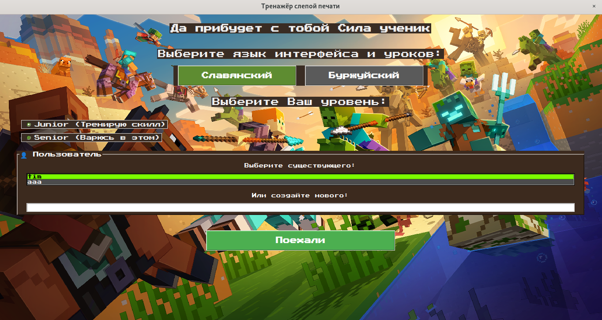
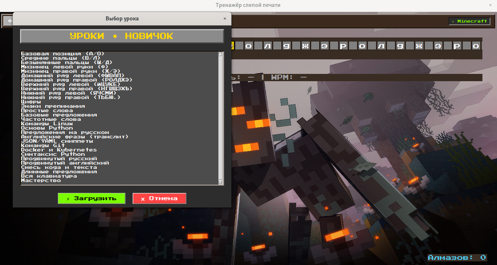
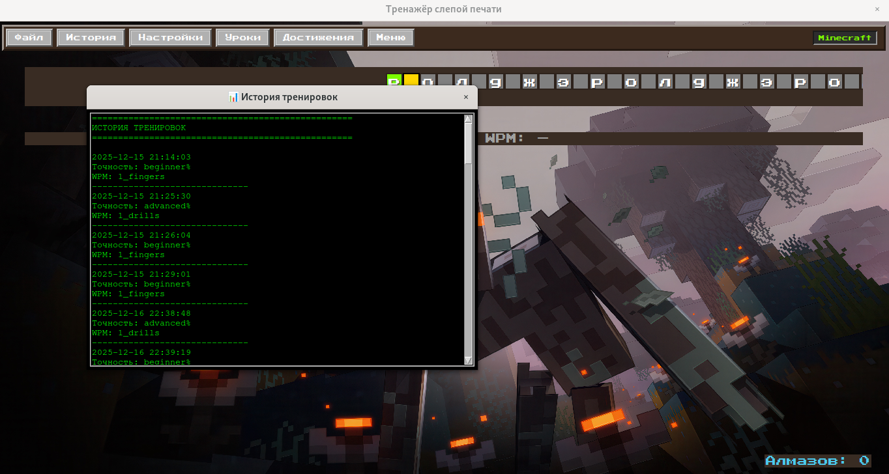
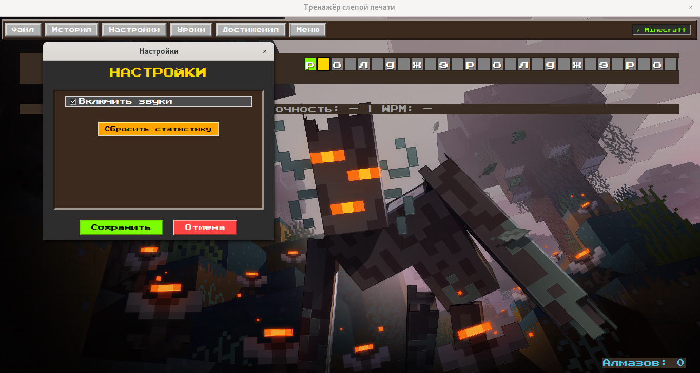

# TypeFlow – тренажёр слепой печати в стиле Minecraft

# TypeFlow – тренажёр слепой печати в стиле Minecraft


## Скриншоты


 
 

## Демо
https://asciinema.org/a/J9DoPrYmMKnX2qYQ

## Возможности
- Два режима: Minecraft / Terminal
- Система пользователей с сохранением прогресса
- 30+ уроков: от базовых позиций до кода (Bash, Python, Git, K8s)
- Алмазы и достижения
- Выбор языка (RU/EN)

## Установка из .deb-пакета (Ubuntu)

1. Скачайте файл `typeflow_1.2_all.deb` из раздела [Releases](https://github.com/Alex305305/typeflow/releases).
2. Установите пакет:
   ```bash
   sudo dpkg -i typeflow_1.2_all.deb
   sudo apt --fix-broken install


## Установка и запуск
```bash
git clone https://github.com/Alex305305/typeflow.git
cd typeflow
pip install -r requirements.txt
python main.py
